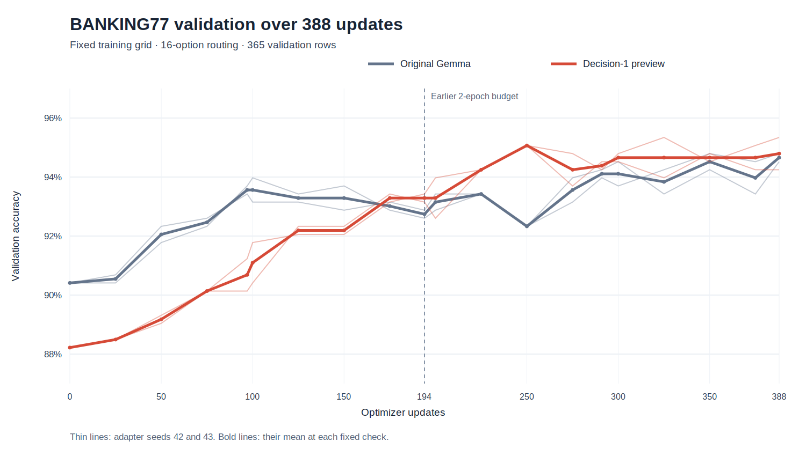

# Worthify Decision-1

**A text model for choosing among the actions your application supplies.** Give it a
state, a question, and 2–16 described options. It returns a selected option ID and
scores for that menu. Decision-1 continues training all 11.9B text parameters of
Gemma 4 12B; it is a full-weight checkpoint, not a merged task adapter.

| Current evidence | Result |
| --- | --- |
| Full-weight held-out evaluation | Seed-42 preview exceeded frozen Gemma on the primary score in **7/7** evaluated families; the earlier task LoRA remained ahead on two evidence-family point estimates. |
| Fresh LoRA on each base, BANKING77 · 388 updates | **93.21%** on Decision-1 versus **93.54%** on original Gemma; −0.32 percentage points on 3,080 transformed 16-option test rows. |
| Fresh LoRA on each base, CTU-13 | **0.115** versus **0.432** macro-F1; the Decision-1 base regressed in this one sealed scenario. |

These are results for the **private, single-seed full-weight preview**, with
validation-selected checkpoint step 3,200. The planned second full-weight seed has not
run; this is not a final two-seed model release. The adapter comparisons use that
preview as the tuned base. No general LoRA advantage or faster convergence is claimed.

## Watch a decision change

**A claim becomes supportable only when an install record arrives.** The fictional
Harbor gateway case asks whether a fix was installed before an audit. With only a
vendor advisory, the model chooses `insufficient`. A later installation log and
inventory record lead it to `supported`. In the complete six-stage authored replay,
it matched four expected routes and missed two. This is a demonstration of the
interface, not an accuracy benchmark.

<video controls playsinline preload="metadata" width="100%" poster="https://huggingface.co/Worthify/Decision-1/resolve/9d832aa4940e4be201008b470ba5790dfe01e402/media/evidence-poster.png" src="https://huggingface.co/Worthify/Decision-1/resolve/48acdb76db1d73e0f481b1e2079e7289db0621cc/media/evidence.mp4"></video>

**The same menu handles traffic shape.** In a synthetic window of small, roughly
periodic outbound records, the model chooses `beacon_like` from descriptions of
observable patterns. It sees connection metadata, not packet payloads. Four of six
authored windows matched their expected route. The label makes no claim about
malicious intent.

<video controls playsinline preload="metadata" width="100%" poster="https://huggingface.co/Worthify/Decision-1/resolve/9d832aa4940e4be201008b470ba5790dfe01e402/media/traffic-poster.png" src="https://huggingface.co/Worthify/Decision-1/resolve/48acdb76db1d73e0f481b1e2079e7289db0621cc/media/traffic.mp4"></video>

**A text-state game keeps moving.** In one falling-block run, code supplied legal
placements and board features as text. The same full-weight model selected placement
goals and buttons for 30 pieces, cleared six lines, and applied 25 rotations while
gravity advanced. This single seed has no raw-Gemma control and is not a gameplay
benchmark. The model did not see pixels.

<video controls playsinline preload="metadata" width="100%" poster="https://huggingface.co/Worthify/Decision-1/resolve/9d832aa4940e4be201008b470ba5790dfe01e402/media/tetris-poster.png" src="https://huggingface.co/Worthify/Decision-1/resolve/48acdb76db1d73e0f481b1e2079e7289db0621cc/media/tetris.mp4"></video>

## Does it make a better base for your LoRA?

The latest, four-epoch BANKING77 comparison **did not show an improvement**
from using Decision-1 as the base. Validation selected seed 42 for both bases:
original Gemma at update 350 scored **93.54%** on the official test and
Decision-1 at update 325 scored **93.21%**. The tuned-minus-original difference
was **−0.32 percentage points**, with a descriptive 77-intent grouped bootstrap
interval of **−0.94 to +0.29 points**. Seed 43 also favored original Gemma:
93.77% versus 92.66%, a **−1.10-point** difference. Excluding the 28 rows flagged
for lexical overlap with full-weight train, validation or test material left a
**−0.36-point** selected-pair difference on 3,052 rows.

Both bases received fresh rank-16 q/k/v/o adapters at seeds 42 and 43, with
seed-matched initial tensors, identical task rows and options, NF4 base loading,
BF16 computation, FP32 final-softcap option loss, optimizer and update budget.
The extension used 1,540 training rows, 365 validation rows, four epochs and
388 updates. Each run's checkpoint and each base's seed were selected on
validation before fresh-process parity checks and sealed-test scoring.

The **latest 388-update study's selected adapters** are available for private
review: [Decision-1 base, update 325](https://huggingface.co/Worthify/worthify-decision-1-banking77-lora-preview/tree/271f72502162b3b408b26dd826a6ca441937bbbb) and
[original-Gemma base, update 350](https://huggingface.co/Worthify/gemma4-banking77-raw-control-lora-preview/tree/ad60b65b644b11a54428445b2f96c3b672ae5d20).
Both are seed-42 packages pinned to immutable commits, with base revisions and
numeric policies recorded. The earlier-study packages are listed separately below.



Decision-1 started lower and had greater baseline-adjusted validation-accuracy
area and greater area over updates 194–388 in both seed pairs. Original Gemma
had greater **absolute area over updates 0–388** in both pairs. All runs were
already above the protocol's 80% threshold at step zero. These validation
trends do not override the held-out result or establish faster convergence.
The historical report field `faster_learning_gate: true` checks only the
baseline-adjusted area, not absolute accuracy or convergence speed.

### What changed from the earlier result?

The earlier, two-epoch BANKING77 study reported **91.62%** on Decision-1 versus
**90.42%** on original Gemma at a 194-update budget: **+1.20 points** for the
selected pair and +0.88 for seed 43. Its selected-pair interval was +0.32 to
+2.14 points. That result motivated the longer experiment; the extension is
an exploratory follow-up, not an independent confirmation. Earlier checkpoints
did not preserve optimizer or RNG state, so all extended adapters started
fresh. The old and new trajectories diverged at the update-97 epoch-end batch;
the cause was not isolated. The new plot is not a resumed or spliced old curve.

The [earlier BANKING77 report](results/worthify/foundation-banking77-transfer-lora-20260926-v1/report.json)
and [earlier paired-outcomes chart](docs/assets/decision-1/matched-lora-outcomes.png)
remain available. The private
[Decision-1 LoRA](https://huggingface.co/Worthify/worthify-decision-1-banking77-lora-preview/tree/b1ca7e69b5441904cb7c8e34cb6f8823c2d82c42)
and [original-Gemma control](https://huggingface.co/Worthify/gemma4-banking77-raw-control-lora-preview/tree/28c650466e81a2539f0f59b2ac541cbce7bd4736)
are the **earlier 194-update study's selected artifacts**, not the extended
study adapters. Each pins its base revision and numeric policy.

The CTU-13 comparison remains a counterexample: on one sealed flow scenario,
original Gemma scored **0.432 macro-F1** and Decision-1 scored **0.115**. Both
adapter seeds favored original Gemma. The task metrics differ and are not
combined into a single average.

BANKING77 was chosen after that CTU-13 regression and is close to intent-routing
data already present in full-weight training, including CLINC150. Every menu
offers the answer plus 15 distractors from 77 intents; these are **not standard
77-way BANKING77 scores**. Lexical exclusion does not establish semantic novelty.
The [extended results and method](docs/FOUNDATION_BANKING77_EXTENDED_LORA_RESULTS.md),
[text-free paired rows](results/worthify/foundation-banking77-extended-lora-20260927-v1/paired-rows.jsonl),
and [evidence guide](docs/EVIDENCE.md) retain the positive and negative outcomes.

## What the full-weight checkpoint measured

The seed-42 run trained on 35,210 rows, selected on a separate 3,200-row validation
set, and scored a sealed 3,200-row test after selection and export verification.
Frozen Gemma, an earlier task LoRA, and the full-weight preview used the same
BF16 batch-four scorer on one A100. The chart plots each family's primary score;
some use macro-F1 and others use accuracy.


| Held-out family · primary metric | Rows | Frozen Gemma | Earlier task LoRA | Decision-1 preview |
| --- | ---: | ---: | ---: | ---: |
| Intent routing · macro-F1 | 768 | 62.21% | 66.38% | **67.29%** |
| WANLI evidence · macro-F1 | 384 | 67.24% | **77.01%** | 74.41% |
| MNLI evidence · macro-F1 | 256 | 76.61% | **90.66%** | 89.61% |
| Authored cyber scenarios · accuracy | 256 | 83.98% | 98.05% | **100.00%** |
| Supplied menus · accuracy | 1,024 | 99.32% | 99.32% | **100.00%** |
| Authored procedures · accuracy | 256 | 91.02% | 99.22% | **100.00%** |
| Authored uncertainty · accuracy | 256 | 85.55% | 100.00% | **100.00%** |

The routing macro-F1 denominator includes 151 offered labels, 46 without a gold
example in the test sample; 512 routing rows use `none_of_above` as gold. The
authored/menu families are bounded fixtures, not evidence of real-world cyber or
operational performance. The [aggregate held-out report](https://huggingface.co/Worthify/Decision-1/blob/48acdb76db1d73e0f481b1e2079e7289db0621cc/evidence/full-weight-seed42-heldout.json)
can be recomputed from the exact text-free held-out prediction rows for
[frozen Gemma](results/worthify/full-weight-seed42-heldout-20260924/frozen/rows.jsonl),
[the earlier task LoRA](results/worthify/full-weight-seed42-heldout-20260924/prior_lora/rows.jsonl), and
[Decision-1](results/worthify/full-weight-seed42-heldout-20260924/full_provisional/rows.jsonl).

## Train a task LoRA

The [pinned Worthify source and training recipe](docs/PUBLIC_TASK_LORA.md)
shows the expected JSONL rows, a fresh adapter run, reload verification, and
evaluation on a separate test file. That repository is private during review.
Compare your adapter with one trained on the pinned original Gemma base under
the same task rows and training budget.

```bash
git clone https://github.com/Worthify-AI/worthify-decision-1.git
cd worthify-decision-1
python -m venv .venv && .venv/bin/python -m pip install -e '.[train]'
```

## Try one decision

The current private preview requires an authorized Worthify Hub login and one
visible CUDA GPU. From the checkout above, create `decisions.jsonl`:

```json
{"id":"route-1","state":{"claim":"Harbor gateway H-2 received release 5.4.2 before the noon audit.","records":[{"source":"gateway installation log","text":"H-2 installed release 5.4.2 successfully.","time":"10:42"},{"source":"asset inventory","text":"Harbor gateway is H-2; installed release 5.4.2.","time":"11:11"}]},"question":"Which evidence route is warranted by the supplied records?","options":[{"id":"supported","description":"The supplied records support the precise claim."},{"id":"contradicted","description":"The supplied records conflict with the precise claim."},{"id":"insufficient","description":"The supplied records do not settle the precise claim."}]}
```

```bash
CUDA_VISIBLE_DEVICES=0 .venv/bin/worthify-lora score \
  --model Worthify/Decision-1 \
  --revision cab55818cfb6f4163f2b2597bed31cceb6ba2030 \
  --quantization nf4 --input decisions.jsonl --output scores.jsonl
```

This exact sample selected `supported` in our single-GPU NF4 usage check. The
scorer writes the chosen **option ID** and conditional menu scores. An
application must validate its options and decide when to request review.
Scores are uncalibrated; they are not probabilities that an action is safe or
a claim is true. This NF4 example uses a different numeric path from the BF16
video replay and batch-four held-out table; choices can differ across those
paths. It is a usage check, not benchmark reproduction. The training prompt
cap was 2,048 tokens. Longer inputs have not been validated.

## Method, provenance, and limits

| Item | Recorded method |
| --- | --- |
| Starting model | `google/gemma-4-12B-it` at `707f0a3b8a3c7ad586ed01e27eafbad8a27dd0f7` |
| Full-weight run | Seed 42; two H200s with FSDP2; two epochs, 4,402 updates; all 11,907,350,272 text parameters trained; validation-selected step 3,200 |
| Training data | 35,210 train / 3,200 validation / 3,200 sealed test; CLINC150 routing, WANLI/MNLI evidence, and authored decision fixtures. Data-manifest SHA-256: `7089b3756e7ed68c9d1ee3712195ce4a0e31162736673c911542f52d8777cddd` |
| Full-weight test | Same held-out rows and BF16 scorer for all three arms; family macro-F1 or accuracy as labeled; 1,000 bootstrap replicates resampled source groups. Intervals do not capture variation across full-weight training seeds. |
| Adapter test | Two matched LoRA seeds per base and task; validation-only checkpoint/seed selection; sealed test; BANKING77 interval resampled 77 original intents 10,000 times. |
| Export | BF16 full weights with FP32 final softcap at 30. Same-A100 serialization matched all option logits on 20 validation rows; a separate H200-to-A100 logit-tolerance check failed, despite no choice changes in that audit. |

This is text-only bounded-choice scoring. The model cannot select an option you
omit, and the present interface accepts at most 16. Browser or game videos
convert their state to text. Native cache paths remain disabled after
equivalence failures. Batch grouping changed logits in diagnostics, so the
main held-out table is a batch-four result rather than a universal
single-request guarantee. The second full-weight seed, five-task adapter
series, final public model revision, and public media verification remain
open release gates.

The Gemma-derived weights carry Apache-2.0 terms with applicable attribution.
Worthify's source additions to MIT-licensed [OpenJev](https://github.com/bonsai/openjev/tree/53e3028363509f8533d90fe82d983770da1f6c02)
remain MIT. CLINC150, WANLI, MultiNLI, and BANKING77 retain their separate
source terms; the [attribution inventory](THIRD_PARTY_WORTHIFY.md)
records their provenance.
Worthify Decision-1 is Worthify's own Gemma post-training. It does not use
TypeSafe Jev output as training labels or claim TypeSafe API compatibility.
