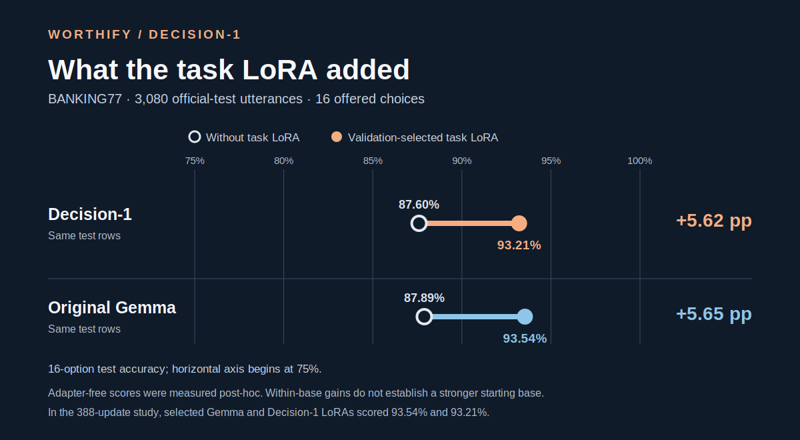

# Worthify Decision-1

Train a task LoRA for a decision your application already makes. Give the model a
text state, a question and 2–16 described options. It returns option IDs and
conditional scores; your software decides what happens next.

**Single-seed preview:** Decision-1 is a full-weight continuation of Gemma 4 12B.
The [weights](https://huggingface.co/Worthify/Decision-1) and
[comparison adapters](https://huggingface.co/Worthify/decision-1-banking77-lora)
are public on Hugging Face. [Model card](MODEL_CARD.md) ·
[Training guide](docs/PUBLIC_TASK_LORA.md) · [Evidence and method](docs/EVIDENCE.md)

## Train your first adapter

Use Python 3.10+ and one visible CUDA GPU. Training defaults to NF4 with BF16
computation; a 12B model needs substantial GPU memory. Install from this checkout:

```bash
python -m venv .venv
. .venv/bin/activate
pip install -e '.[train]'
```

Supply separate JSONL train, validation and test files. Each row describes one
decision; related source records should share a `group_id`.

```json
{"id":"ticket-1","group_id":"customer-1","state":"My card payment failed and shows a pending charge.","question":"Which team should handle this?","options":[{"id":"payments","description":"Payment support"},{"id":"account","description":"Account access support"}],"gold_option_id":"payments"}
```

Run this authored example to check your setup, then replace the files with your
own task. The tiny example is a workflow check, not a useful trained model or a
performance benchmark.

```bash
MODEL_ID=Worthify/Decision-1
MODEL_REVISION=cab55818cfb6f4163f2b2597bed31cceb6ba2030

CUDA_VISIBLE_DEVICES=0 worthify-lora train \
  --model "$MODEL_ID" --revision "$MODEL_REVISION" \
  --train examples/support/train.jsonl --validation examples/support/validation.jsonl \
  --seed 42 --epochs 2 --output runs/support-42

CUDA_VISIBLE_DEVICES=0 worthify-lora verify \
  --model "$MODEL_ID" --revision "$MODEL_REVISION" \
  --run runs/support-42 --validation examples/support/validation.jsonl \
  --output runs/support-42-verification.json

CUDA_VISIBLE_DEVICES=0 worthify-lora evaluate \
  --model "$MODEL_ID" --revision "$MODEL_REVISION" \
  --run runs/support-42 --validation examples/support/validation.jsonl \
  --input examples/support/test.jsonl --output runs/support-42-test.jsonl
```

Use new output paths for every run. Select using validation, then evaluate test
once. `worthify-lora score` accepts the same decision schema without gold labels.
[The guide](docs/PUBLIC_TASK_LORA.md) covers pinning, outputs and reload checks.

## What a task LoRA adds

On the same 3,080 official BANKING77 test utterances, converted into
deterministic 16-option menus, each base improved after task adaptation:

| Starting model | Zero-shot, no task LoRA | Selected task LoRA | Gain |
| --- | ---: | ---: | ---: |
| Decision-1 | 87.60% (2,698/3,080) | **93.21%** (2,871/3,080) | **+5.62 points** |
| Original Gemma | 87.89% (2,707/3,080) | **93.54%** (2,881/3,080) | **+5.65 points** |



The paired 77-intent bootstrap intervals for these gains are +3.21 to +8.57
points on Decision-1 and +3.28 to +8.44 on original Gemma. "Zero-shot" here
means no BANKING77 task adapter or examples in the prompt. We scored these
baselines after viewing the adapter outcomes; full-weight Decision-1 training
included related intent-routing data, and 28 test rows had flagged lexical
overlap. These are descriptive within-base gains. [Inspect the method, report,
and text-free paired rows](docs/EVIDENCE.md).

## Does Decision-1 beat original Gemma after LoRA training?

The within-base gains above are separate from the matched starting-base
comparison. These are validation-selected adapters with two seeds per base:

| Study | LoRA on original Gemma | LoRA on Decision-1 |
|---|---:|---:|
| BANKING77, 388 updates · 16-option accuracy | **93.54%** | 93.21% |
| Earlier BANKING77, 194 updates · 16-option accuracy | 90.42% | **91.62%** |
| CTU-13, one held-out flow scenario · macro-F1 | **0.432** | 0.115 |

Review the **latest 388-update study adapters**:
[LoRA on Decision-1](https://huggingface.co/Worthify/decision-1-banking77-lora) ·
[original-Gemma control](https://huggingface.co/Worthify/gemma4-banking77-control-lora).
These public packages pin their base revisions and adapter weight hashes.


Under the 388-update budget, original Gemma scored higher on test in both seed pairs. The
selected pair's tuned-minus-original difference was −0.32 percentage points,
with a descriptive 77-intent bootstrap interval of −0.94 to +0.29 points.
Decision-1 improved more from its lower validation baseline and performed better
over the later validation interval; original Gemma had higher absolute
validation-accuracy AUC over the full run. This does not establish a general
LoRA advantage or faster convergence.

BANKING77 was chosen after CTU-13, and the extension was chosen after the
194-update result. The extension used fresh adapters; its early trajectory was
not byte-identical to the earlier run. These are transformed 16-option results,
not standard 77-way BANKING77 scores. [Check the rows and method](docs/EVIDENCE.md).

Scores depend on the options offered and are **not calibrated confidence**.
The interface cannot choose a missing option. Prompt length, precision and batch
grouping can change results. Use your own held-out task to assess suitability.

## Verify this repository

```bash
pip install -e '.[test]'
pytest -q
(cd results/raw && sha256sum -c SHA256SUMS)
python benchmarks/verify_published.py
python benchmarks/verify_decision_1.py
python scripts/verify_snapshot.py
```

The first benchmark verifier preserves 69 upstream baseline checks; the second
recomputes Decision-1 headline metrics from text-free prediction rows.
[Source provenance](SOURCE_PROVENANCE.json) pins the curated files to their
research-source revision. No weights, caches or third-party source text are
included. Code derives from MIT-licensed OpenJev; weights and datasets retain
[their separate terms](THIRD_PARTY_WORTHIFY.md).
