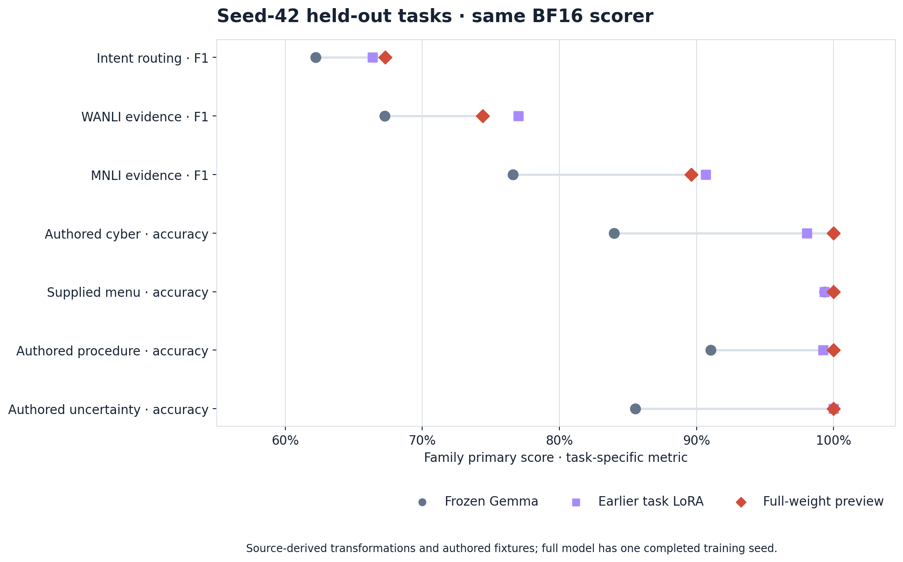

# Worthify Decision-1

Train a task LoRA for a decision your application already makes. Give the model a
text state, a question and 2–16 described options. It returns option IDs and
conditional scores; your software decides what happens next.

Decision-1 is a **full-weight continuation of Gemma 4 12B**. Its validation-selected
single-seed checkpoint exceeded frozen Gemma on the primary score in all seven
evaluated families across a 3,200-row held-out test. Intent-routing macro-F1
was **67.29% versus 62.21%**; WANLI-derived evidence macro-F1 was **74.41% versus
67.24%**. Four families use authored or supplied-menu fixtures, so these
results do not predict performance on an arbitrary application.



All three arms used the same BF16 batch-four scorer on one A100. The earlier
task LoRA scored higher on the WANLI and MNLI evidence point estimates.

[Model weights](https://huggingface.co/Worthify/Decision-1) ·
[Model card](MODEL_CARD.md) ·
[Training guide](docs/PUBLIC_TASK_LORA.md) ·
[Evidence and method](docs/EVIDENCE.md)

## Train your first adapter

Use Python 3.10+ and one visible CUDA GPU. Training defaults to NF4 with BF16
computation; a 12B model needs substantial GPU memory. Install from this checkout:

```bash
python -m venv .venv
. .venv/bin/activate
pip install -e '.[train]'
```

Supply separate JSONL train, validation and test files. Each row describes one
decision; related source records should share a `group_id`.

```json
{"id":"ticket-1","group_id":"customer-1","state":"My card payment failed and shows a pending charge.","question":"Which team should handle this?","options":[{"id":"payments","description":"Payment support"},{"id":"account","description":"Account access support"}],"gold_option_id":"payments"}
```

Run this authored example to check your setup, then replace the files with your
own task. The tiny example is a workflow check, not a useful trained model or a
performance benchmark.

```bash
MODEL_ID=Worthify/Decision-1
MODEL_REVISION=cab55818cfb6f4163f2b2597bed31cceb6ba2030

CUDA_VISIBLE_DEVICES=0 worthify-lora train \
  --model "$MODEL_ID" --revision "$MODEL_REVISION" \
  --train examples/support/train.jsonl --validation examples/support/validation.jsonl \
  --seed 42 --epochs 2 --output runs/support-42

CUDA_VISIBLE_DEVICES=0 worthify-lora verify \
  --model "$MODEL_ID" --revision "$MODEL_REVISION" \
  --run runs/support-42 --validation examples/support/validation.jsonl \
  --output runs/support-42-verification.json

CUDA_VISIBLE_DEVICES=0 worthify-lora evaluate \
  --model "$MODEL_ID" --revision "$MODEL_REVISION" \
  --run runs/support-42 --validation examples/support/validation.jsonl \
  --input examples/support/test.jsonl --output runs/support-42-test.jsonl
```

Use new output paths for every run. Select using validation, then evaluate test
once. `worthify-lora score` accepts the same decision schema without gold labels.
[The guide](docs/PUBLIC_TASK_LORA.md) covers pinning, outputs and reload checks.

## Evaluate your own task

A LoRA is a small set of task-trained weights used with a frozen base model.
The public [Decision-1 adapter](https://huggingface.co/Worthify/decision-1-banking77-lora)
and [original-Gemma control](https://huggingface.co/Worthify/gemma4-banking77-control-lora)
show how to package and verify one. The [adapter comparison and row-level
results](docs/EVIDENCE.md) do not establish that Decision-1 is a better LoRA
starting point. Measure your own held-out task against a suitable control.

Scores depend on the offered options and are **not calibrated confidence**. The
model cannot choose a missing option. Prompt length, precision, and batch
grouping can change results.

## Verify this repository

```bash
pip install -e '.[test]'
pytest -q
(cd results/raw && sha256sum -c SHA256SUMS)
python benchmarks/verify_published.py
python benchmarks/verify_decision_1.py
python scripts/verify_snapshot.py
```

The first benchmark verifier preserves 69 upstream baseline checks; the second
recomputes Decision-1 headline metrics from text-free prediction rows.
[Source provenance](SOURCE_PROVENANCE.json) pins the curated files to their
research-source revision. No weights, caches or third-party source text are
included. Code derives from MIT-licensed OpenJev; weights and datasets retain
[their separate terms](THIRD_PARTY_WORTHIFY.md).
